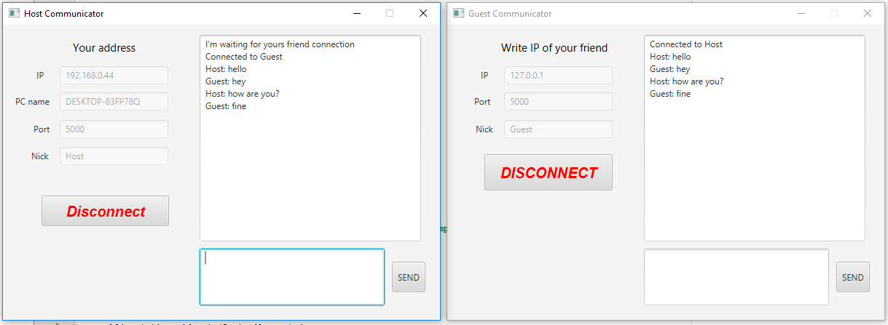

# CommunicatorP2P
Academic project written in Java 10.0.1 
Simple app where you can easly communicate with your friend.
  
Program uses Java Socket (TCP/IP protocol). 
Program will work properly only in your local web.

